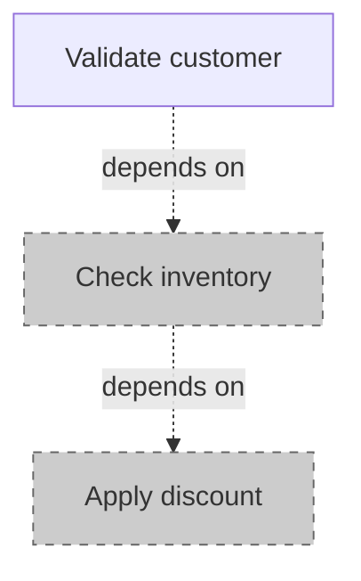
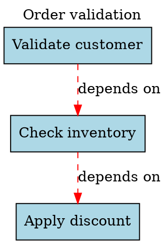

# Rule Graph Visualization

Generate dependency diagrams from your workflows for debugging, documentation, and code review. RoslynRules outputs both Graphviz DOT and Mermaid formats.

## Overview

```csharp
using RoslynRules.Models;

// From a workflow
var dot = RuleGraphVisualizer.ToDot(workflow);
var mermaid = RuleGraphVisualizer.ToMermaid(workflow);

// From a single rule tree
var dot = RuleGraphVisualizer.ToDot(rule);
```

| Format | Renders In | Best For |
|--------|-----------|----------|
| DOT | Graphviz, VS Code extensions, web tools | Complex graphs, PDF export |
| Mermaid | GitHub, GitLab, Notion, Markdown | README docs, PR descriptions |

## Mermaid (Recommended for Docs)

Mermaid diagrams render natively in GitHub/GitLab markdown. Paste the output directly into a `.md` file:

```csharp
var workflow = new Workflow
{
    Description = "Order validation",
    Rules =
    {
        new Rule
        {
            Description = "Validate customer",
            Expression = "customer.IsActive",
            Id = Guid.Parse("11111111-1111-1111-1111-111111111111")
        },
        new Rule
        {
            Description = "Check inventory",
            Expression = "inventory.HasStock",
            DependsOnRuleId = Guid.Parse("11111111-1111-1111-1111-111111111111")
        },
        new Rule
        {
            Description = "Apply discount",
            Expression = "order.Total > 100",
            DependsOnRuleId = Guid.Parse("22222222-2222-2222-2222-222222222222")
        }
    }
};

Console.WriteLine(RuleGraphVisualizer.ToMermaid(workflow));
```

**Output:**


## Graphviz DOT

Use DOT for local visualization or CI pipeline checks:

```csharp
var dot = RuleGraphVisualizer.ToDot(workflow);
File.WriteAllText("workflow.dot", dot);
```

**Convert to PNG:**
```bash
dot -Tpng workflow.dot -o workflow.png
```

**Example DOT output:**


## Visual Elements

| Element | Meaning |
|---------|---------|
| Red dashed edge | `DependsOnRuleId` dependency |
| Blue solid edge | Parent-child relationship |
| `box3d` shape | Rule with child rules |
| `box` shape | Leaf rule (no children) |
| Light blue fill | Active rule |
| Light grey / dashed | Inactive rule |

## Including Inactive Rules

By default, inactive rules are hidden. Include them to audit your full rule set:

```csharp
var dot = RuleGraphVisualizer.ToDot(workflow, includeInactive: true);
var mermaid = RuleGraphVisualizer.ToMermaid(workflow, includeInactive: true);
```

## Single Rule Trees

Visualize just one rule and its descendants:

```csharp
var rootRule = workflow.Rules.First();
var dot = RuleGraphVisualizer.ToDot(rootRule);
```

## CI Integration

Generate diagrams in CI to catch unintended dependency changes:

```yaml
- name: Generate rule graph
  run: |
    dotnet run --project MyApp -- generate-rule-graph
    dot -Tpng rules.dot -o rules.png
- name: Upload diagram
  uses: actions/upload-artifact@v4
  with:
    name: rule-graph
    path: rules.png
```

## Escaping

Labels are automatically escaped for their target format:
- DOT: quotes, backslashes, newlines
- Mermaid: brackets, parentheses, braces
