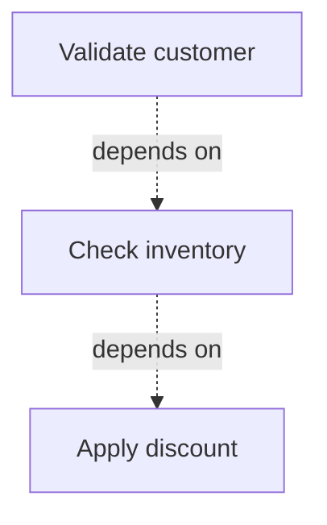

[← Back to Examples Index](index.md)

# Visualization

Generate dependency diagrams from your workflows for debugging and documentation.

## Mermaid for GitHub READMEs

Mermaid diagrams render natively in GitHub/GitLab markdown:

```csharp
var workflow = new Workflow
{
    Description = "Order validation",
    Rules =
    {
        new Rule
        {
            Description = "Validate customer",
            Expression = "customer.IsActive"
        },
        new Rule
        {
            Description = "Check inventory",
            Expression = "inventory.HasStock",
            DependsOnRuleId = workflow.Rules[0].Id
        },
        new Rule
        {
            Description = "Apply discount",
            Expression = "order.Total > 100",
            DependsOnRuleId = workflow.Rules[1].Id
        }
    }
};

Console.WriteLine("```mermaid");
Console.WriteLine(RuleGraphVisualizer.ToMermaid(workflow));
Console.WriteLine("```");
```

**Output:**


Paste into a `.md` file and GitHub renders it automatically.

## Graphviz for PDF Export

```csharp
var dot = RuleGraphVisualizer.ToDot(workflow);
File.WriteAllText("workflow.dot", dot);
```

Convert to PNG:
```bash
dot -Tpng workflow.dot -o workflow.png
```

## Including Inactive Rules

Audit your full rule set including disabled rules:

```csharp
var mermaid = RuleGraphVisualizer.ToMermaid(workflow, includeInactive: true);
// Inactive rules shown with dashed styling
```

## Single Rule Tree

Visualize just one rule and its descendants:

```csharp
var rootRule = workflow.Rules.First();
var dot = RuleGraphVisualizer.ToDot(rootRule);
```

## CI Pipeline

Generate diagrams on every build:

```yaml
- name: Generate rule graph
  run: dotnet run --project MyApp -- generate-graph
- name: Upload diagram
  uses: actions/upload-artifact@v4
  with:
    name: rule-graph
    path: rules.png
```

## Visual Legend

| Element | Meaning |
|---------|---------|
| Red dashed edge | `DependsOnRuleId` dependency |
| Blue solid edge | Parent-child relationship |
| `box3d` shape | Rule with children |
| `box` shape | Leaf rule |
| Light blue | Active rule |
| Grey dashed | Inactive rule |
